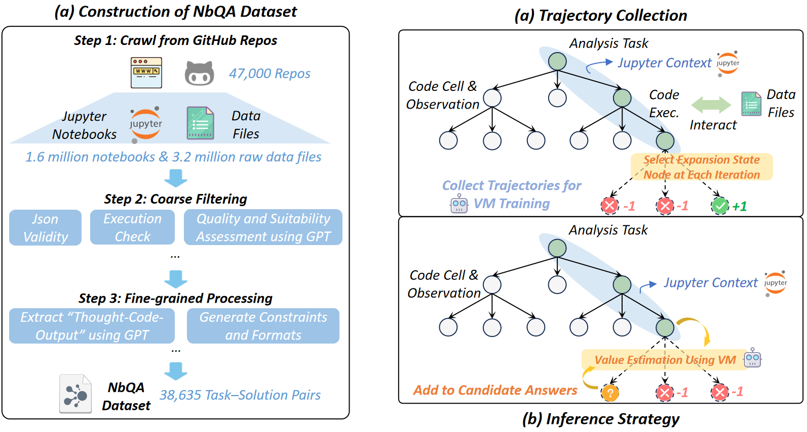

# Jupiter: Enhancing LLM Data Analysis Capabilities via Notebook and Inference-Time Value-Guided Search

<p align="center">
  <a href="https://arxiv.org/abs/2509.09245">
    
  </a>
</p>

## Introduction

JUPITER enhances the multi-step reasoning and tool-use capabilities of large language models in data analysis. By leveraging the constructed NbQA dataset, which contains task-solution pairs extracted from Jupyter Notebooks, JUPITER uses Monte Carlo Tree Search (MCTS) to generate diverse solution paths and combines the trained value model for efficient search during inference, significantly improving the accuracy and efficiency of data analysis tasks.

> **📄 Paper**: This repository contains the open-source implementation of **Jupiter: Enhancing LLM Data Analysis Capabilities via Notebook and Inference-Time Value-Guided Search** ([arXiv:2509.09245](https://arxiv.org/abs/2509.09245))  
>*Authors: Shuocheng Li, Yihao Liu, Silin Du, Wenxuan Zeng, Zhe Xu, Mengyu Zhou, Yeye He, Haoyu Dong, Shi Han, Dongmei Zhang*


## 🎯 Overview

Data analysis tasks often require complex multi-step reasoning, where existing large language models typically fall short. To address this challenge, this work introduces the JUPITER framework, which combines the NbQA dataset and Monte Carlo Tree Search to model data analysis as a sequential decision-making problem. By using the trained value model to guide the reasoning process, JUPITER significantly improves multi-step reasoning, tool use, and generalization capabilities, surpassing existing models and systems across various benchmark tasks.




## 📁 Content Description

### Environment Configuration

To install the relevant dependencies required for inference and search, use the following command in a conda environment to configure the environment:

```bash
pip install jupyter ipykernel vllm pandas matplotlib tqdm sandbox-fusion pyarrow fastparquet datasets
```


We use [SandboxFusion](https://github.com/bytedance/SandboxFusion) to run model-generated code. To resolve the issue of [Ipython being outdated](https://github.com/bytedance/SandboxFusion/issues/54), please first navigate to the `sandbox_configuration` directory and run:

```bash
docker build -t sandbox-fixed:20250609 -f Dockerfile.mysandbox .
```

Also, modify the `max_concurrency` and `max_runner_concurrency` settings in the `local.yaml` file according to your server resources. We start the Python sandbox Docker using the following command:

```
docker run --cpus=64 -e OMP_NUM_THREADS=32 -it -p 8080:8080 -v Path/to/local.yaml:/root/sandbox/sandbox/configs/local.yaml sandbox-fixed:20250609
```


### NbQA dataset

The `dataset` directory contains the NbQA dataset and the visualization tasks that were not used in the paper. Due to policy reasons, we will not directly distribute the original Jupyter notebooks and data files used to generate each sample. We will only indicate the notebook file names and the corresponding original GitHub repository links, along with the names of the data files required to execute the notebook. If, in addition to SFT, you want to train your own value model, you should crawl the data files required to execute the task from each dataset sample using the `github_repo`, `ipynb_name`, and `file_names` fields, and handle the path issues yourself.

Note: The repositories may be modified or deleted. Additionally, the notebook and files indicated in the fields may not necessarily be located in the root directory of the repository, and there could be notebooks or files with the same name.


Explanation of each sample's fields:

- **solution**: A list of steps detailing the solution, each may contain:
  - **thought**: The reasoning behind each step.
  - **python_code**: The code used for the step.
  - **code_output**: The result of running the code.
  - **label**: The formatted answer for the task.
- **task**: A description of the task to be performed.
- **file_names**: A list of files involved in the task.
- **answer**: The raw result of the task.
- **concepts**: Key concepts related to the task (e.g., Machine Learning).
- **difficulty**: The difficulty level of the task (e.g., easy).
- **constraints**: Constraints that must be followed while solving the task.
- **format**: The required structure for the output.
- **label**: The formatted answer for the task.
- **github_repo**: A link to the origin GitHub repository.
- **ipynb_name**: The name of the origin Jupyter notebook that task was generated from.

In the paper, we fine-tuned the model using data from `train_sft_data.jsonl`, and a portion of this data, `train_collect_data.jsonl`, was used to collect trajectory data for training the value model. You can use `process_sft.py` to convert the data from `train_sft_data.jsonl` into a multi-turn dialogue format required by [LLaMA-Factory](https://github.com/hiyouga/LLaMA-Factory), and then follow the [docs](https://llamafactory.readthedocs.io/zh-cn/latest/) to perform supervised fine-tuning using LLaMA Factory.

If you need to train the value model to reproduce the results in the paper, you will need to download the task data files from `train_collect_data.jsonl`, and for each task sample, add a `data_files` field with a list of relative file paths in your storage directory.

Note: The samples in the `visualization` directory involve visualization, so the `label`, `format`, and `answer` fields might be empty strings or `None`. In the `solution` field, if any `code_output` contains image outputs, the image data will be replaced with the local path where the original notebook's images are saved. The path format is similar to:

``.

If you need the original image data, you must download the original notebook, convert it to markdown format using [nbconvert](https://nbconvert.readthedocs.io/en/latest/), and then locate the corresponding image path in the local saved files.


### Jupyter Framework

To directly test the ReAct method on InfiAgent DABench, first download the [InfiAgent-DAbench data](https://github.com/InfiAgent/InfiAgent/tree/main/examples/DA-Agent/data) to the `infiagent_evaluation/data` directory, and then run `infiagent_evaluation/inferenc.py`. Before running, specify the values for `HF_TOKEN`, `model_path`, and `MAX_TOKENS` in the script. The test results will be saved in the `inference_output` directory, and then run `eval.py` to get the accuracy and other metrics. Similarly, you can test majority voting on InfiAgent DABench by running `inference_vote.py` and `eval_majority.py`.

Note: Some models like Qwen2.5 require modifications to the model's `config.json` to support long context. For details, refer to [#processing-long-texts](https://huggingface.co/Qwen/Qwen2.5-7B-Instruct#processing-long-texts).

#### Trajectory Collection

Run `mcts_search/collect/mcts.py` to collect model inference trajectories for tasks in `train_collect_data.jsonl` (Note: You need to prepare the required data files for the tasks in `train_collect_data.jsonl` and place them in the correct directory). Before running, specify the values for `HF_TOKEN`, `model_path`, `data_to_collect_path`, `data_to_collect`, and `data_files_base_path` in the script. You can also modify the `config.py` in the same directory to configure search parameters.

Once trajectory collection is complete, specify the `collected_output_dir` and `output_estimate_file` in the `post_analysis.ipynb` script and run it to obtain the input JSON file for training the value model.

Finally, run `mcts_search/value_model/train.py` to train the value model:

```
python train.py --model_name_or_path "path/to/base_model" --train_data "path/to/value_model_training_data" --lora --gpu_id 0 --merge_lora
```

Note: Due to issues with the `Transformers` version, the saved checkpoint directory might lack tokenizer-related files. You can simply copy the tokenizer files (such as `tokenizer.json`) from the base model directory.

#### Inference Strategy

Run `mcts_search/inference/inference.py` to search on InfiAgent-DABench without value model guidance:

```bash
python inference.py --test_mode
```

Run `mcts_search/inference/inference_value_guided.py` to search on InfiAgent-DABench with value model guidance:

```bash
python inference_value_guided.py --test_mode --use_value_model
```

For explanations of other command-line parameters like `model_path`, refer to the script comments.

The search results are saved in the `mcts_output` directory by default. Run `post_process.ipynb` to process the results and save the final answers in the `inference_output` directory. Then, run `infiagent_evaluation/eval.py` to obtain the accuracy and other metrics:

```
python eval.py --response_files_path path/to/inference_output
```


### Other Benchmark Evaluation

**AIME2025**

Refer to the `mcts_search/aime` directory. You need to first prepare the parquet file using `mcts_search/aime/dataset/aime2025/preprocess.py`.

**DSBench**

First, refer to the original [DSBench](https://github.com/LiqiangJing/DSBench) repository to download and extract `data.zip` and `save_performance.zip`, and simplify the task descriptions of data modeling tasks based on the prompts provided in the paper's support materials.

Run `mcts_search/inference/inference_value_guided_ds.py` to search and generate submission files for data modeling tasks in DSBench, saving them to the `mcts_output_ds` directory. Then, move the relevant files from `dsbench_evaluation` to the `DSBench/data_modeling` directory and run to check whether the submission files for each task exist and can be correctly submitted, and calculate the corresponding RPG metric scores.

## Citation
If you find this repository useful, please consider giving ⭐ or citing:
```
@misc{li2025jupiterenhancingllmdata,
      title={Jupiter: Enhancing LLM Data Analysis Capabilities via Notebook and Inference-Time Value-Guided Search}, 
      author={Shuocheng Li and Yihao Liu and Silin Du and Wenxuan Zeng and Zhe Xu and Mengyu Zhou and Yeye He and Haoyu Dong and Shi Han and Dongmei Zhang},
      year={2025},
      eprint={2509.09245},
      archivePrefix={arXiv},
      primaryClass={cs.AI},
      url={https://arxiv.org/abs/2509.09245}, 
}
```

## Contributing

This project welcomes contributions and suggestions.  Most contributions require you to agree to a
Contributor License Agreement (CLA) declaring that you have the right to, and actually do, grant us
the rights to use your contribution. For details, visit https://cla.opensource.microsoft.com.

When you submit a pull request, a CLA bot will automatically determine whether you need to provide
a CLA and decorate the PR appropriately (e.g., status check, comment). Simply follow the instructions
provided by the bot. You will only need to do this once across all repos using our CLA.

This project has adopted the [Microsoft Open Source Code of Conduct](https://opensource.microsoft.com/codeofconduct/).
For more information see the [Code of Conduct FAQ](https://opensource.microsoft.com/codeofconduct/faq/) or
contact [opencode@microsoft.com](mailto:opencode@microsoft.com) with any additional questions or comments.

## Trademarks

This project may contain trademarks or logos for projects, products, or services. Authorized use of Microsoft 
trademarks or logos is subject to and must follow 
[Microsoft's Trademark & Brand Guidelines](https://www.microsoft.com/en-us/legal/intellectualproperty/trademarks/usage/general).
Use of Microsoft trademarks or logos in modified versions of this project must not cause confusion or imply Microsoft sponsorship.
Any use of third-party trademarks or logos are subject to those third-party's policies.